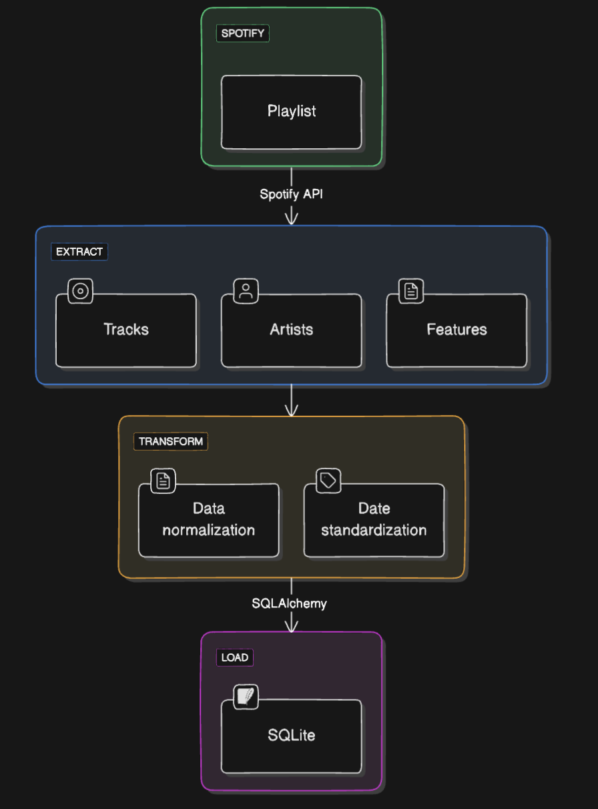
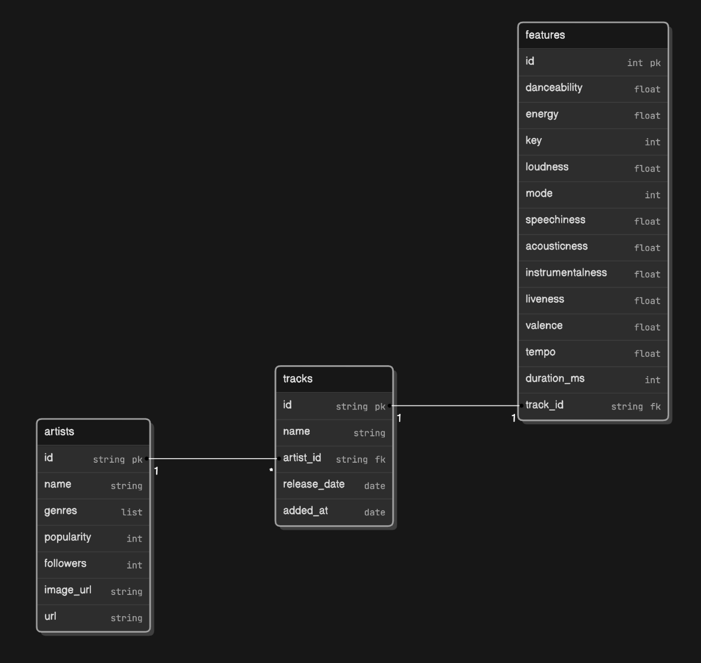

# 

This project automates the process of finding the most popular artists by::

1. Crawling: Extracting song listings from 3 differents Album in Spotìy Web API.
2. Filtering: Evaluating each factor's relevance to a playlist's based on artists, audio features and tracks, eliminating unsuitable listings.
3. This SQL query performs data analysis to identify featured artists based on their number of songs, average popularity, and total number of followers in the database.
4. This query will return a list of the top 10 artists based on the number of songs they have in their database, along with their average popularity and total number of followers. 
5. The list is sorted so that the artists with the most songs are at the top, and in the case of the same number of songs, the artist with the higher average popularity is prioritized.
6. Output: Generating structured JSON files with the filtered and scored song data for easy review.

## Features
- **Multi-Platform Scraping**: Collects a diversified set of music playlists to broaden the candidate's possibilities.
- **Intelligent Filtering**: Uses AI to determine song compatibility based on a playlist..
- **Structured Output**: Establish clean JSON files with important song data and relevance criteria..
- **Customizable**: Easily customize the music profile or filtering criteria to meet certain requirements..
- **Efficient**: Automatically identifies featured artists..

## ETL Pipeline Structure of Data Processing

## Usage: 
The collect of Data will be analyze featured artists in playlists: Identify featured artists in playlists, based on song count, popularity, and musical characteristics.

## Purpose:
1. Understanding User interests: 

Purpose: Identifying popular musicians in playlists may provide insights into consumers' musical interests and trends.

Application: This information may be used to tailor the user experience by recommending new music or artists that they would like.

2. Marketing and collaborations: 

Purpose: Popular artists and songs might be targeted for marketing campaigns or commercial collaborations.

This information may be used by music firms, labels, and streaming platforms to develop promotional campaigns, plan events, and collaborate with artists on special initiatives.

3. Catalog Management: 

Purpose: Identify top artists to optimize content management and dissemination.

Applications: Catalog managers may utilize promotions to highlight songs or albums by featured artists, as well as build unique playlists to entice users.

4. Market Analysis and Music Trends: 

Purpose: Identify new artists in playlists to anticipate future music trends.

Applications: Market analysts may use this data to predict the market or to help them make investment choices on new performers or music genres.

5. Artist success Measurement: 

Purpose: This study helps labels and artists measure the success of songs and albums in playlists.

Applications: The data may assist artists and managers better understand their popularity, allowing them to alter their music release and marketing methods.
